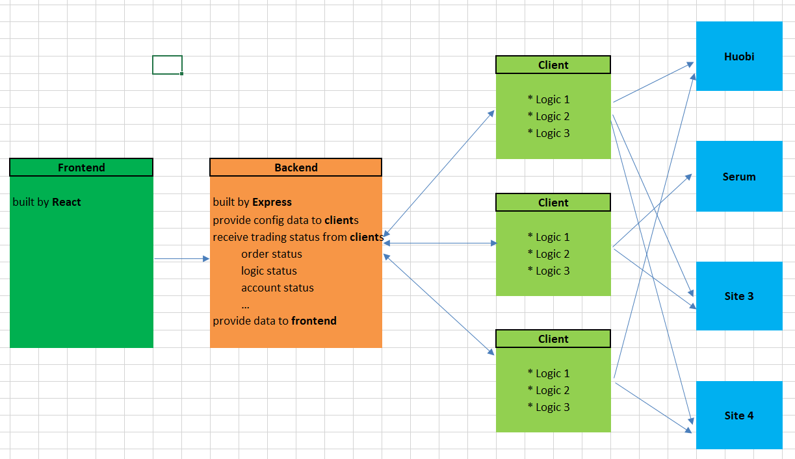

# zeta-bot

The project contains three parts - *client*, *frontend* and *backend*.
You can monitor trading by webpage and can access database.
*client* get config information from *backend* and process trading.
We can manage several *client*s by single *frontend* and *backend*.

## *client*
The start point is Core/TradeManager.ts.

## *frontend*
This will be built by **React**.

## *backend*
This will be built by **Express**.

